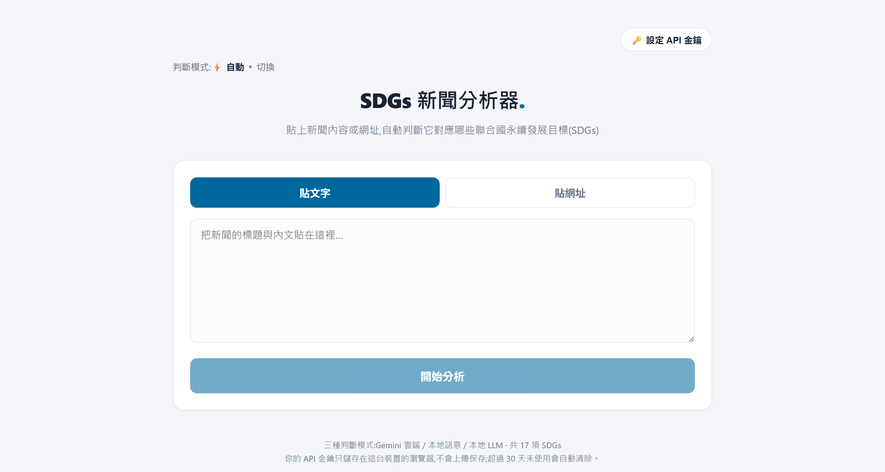

# SDGs 新聞分析器

貼上一篇(大學/學校)新聞的內容或網址,自動判斷它對應到哪些聯合國永續發展目標(SDGs,共 17 項)。專為校園新聞調校,會從「教學 / 研究 / 校務營運 / 社區參與」四個面向判讀。

**[線上使用](https://sdgs-news.pages.dev) · [作品介紹與開發故事](https://cornhsu.com/sdgs-news)**



核心設計是**不綁卡就零費用**:每個用到雲端額度的地方都有上限保護,額度用完只會降級、不會扣錢。
凡是能在瀏覽器做的判斷都留在瀏覽器裡,使用者的金鑰不經過伺服器。

## 三層判斷

三層之間自動切換,使用者不會遇到「請先設定 XXX」的死胡同。預設模式是「自動」:有金鑰就走 Gemini,沒有就走語意,兩者不可用時退回關鍵字。

| 層 | 用什麼 | 說明 |
|---|---|---|
| **關鍵字快篩** | `lib/sdgs.js` | 17 項 SDG 各自維護關鍵字清單,是最終保底——所有 AI 服務都失效時仍給得出結果。免服務、免金鑰。 |
| **語意向量** | Workers AI `@cf/baai/bge-m3`,額度用完改用瀏覽器內的 `Xenova/paraphrase-multilingual-MiniLM-L12-v2` | 只給相關度分數、不給理由。雲端與本機兩條路徑同介面,自動切換。 |
| **Gemini(自帶金鑰)** | `lib/geminiClient.js` | 最準的一層,會套用防偏差規則並給出判斷理由。 |

## 架構(前端為主)

- **前端(靜態網站)**:介面 + 關鍵字快篩 + 直接呼叫 Gemini + 本機語意模型。
  使用者的 API 金鑰只存在他自己的瀏覽器(localStorage),分析時瀏覽器**直接**打給 Google,金鑰不經過任何伺服器。30 天未使用會自動清除。
- **`functions/api/fetch.js`**:代抓新聞網頁內文(解決瀏覽器跨域限制),完全不碰金鑰。
- **`functions/api/embed.js`**:呼叫 Workers AI 算向量,並以 KV 記錄每日呼叫次數。
  硬性上限 `DAILY_CAP = 900`(壓在免費的每天 10,000 Neurons 與 KV 每天 1,000 次寫入之內),
  達標即回 429,前端自動改用瀏覽器本機模型——**用完不會扣錢,只會功能降級**。

17 項 SDG 的雲端向量是靜態內容,已預先算好存在 `lib/sdgEmbeddingsCloud.json`,
執行時只算「這篇新聞」一個向量,再與 17 個做 cosine similarity,額度用量降到最低。

更完整的技術總覽(用了哪些語言/框架/模型、為什麼這樣設計)見 [TECH.md](TECH.md)。

## 本機開發

```bash
npm install
npm run dev        # 只測「貼文字」分析(http://localhost:3000)
npm run preview    # 完整預覽,含「貼網址」代抓功能(用 Cloudflare 模擬器)
```

> 「貼文字」模式在 `npm run dev` 就能測;「貼網址」需要 Cloudflare Function,請用 `npm run preview`。

## 部署 / 更新上線

改完程式後,一行指令重新部署:

```bash
npm run deploy
```

(等同 `next build` + `wrangler pages deploy out`,上傳到 Cloudflare Pages 專案 `sdgs-news`。)

第一次在新電腦操作前需先登入:`npx wrangler login`。

## 重要:不要在伺服器設定金鑰

這是「使用者自帶金鑰」的網站。**請勿**在 Cloudflare 設定 `GEMINI_API_KEY` 環境變數,否則所有人會共用你的金鑰並由你付費。

## 調整建議

- 判斷更準:在 `lib/sdgs.js` 增補各目標關鍵字。
- 改 AI 規則 / 門檻:`lib/geminiClient.js`(提示語、`score >= 40`、模型 fallback 清單)。
- 金鑰清除天數:`lib/keyStore.js` 的 `INACTIVITY_DAYS`。

## 檔案結構

| 檔案 | 用途 |
| --- | --- |
| `app/page.js` | 前端頁面 + 分析流程(三層判斷的切換與結果組合) |
| `app/globals.css` | 樣式 |
| `lib/sdgs.js` | 17 項 SDGs 資料 + 關鍵字比對(第一層) |
| `lib/localSemantic.js` | 語意層:雲端向量與瀏覽器本機模型的統一入口(第二層) |
| `lib/sdgEmbeddingsCloud.json` | 預先算好的 17 個 SDG 雲端向量 |
| `lib/geminiClient.js` | 瀏覽器端呼叫 Gemini(第三層) |
| `lib/prompt.js` | Gemini 提示語與防偏差規則 |
| `lib/keyStore.js` | 金鑰本機儲存 + 30 天清除 |
| `functions/api/fetch.js` | Cloudflare Function:代抓新聞網頁 |
| `functions/api/embed.js` | Cloudflare Function:Workers AI 向量 + KV 每日上限 |
| `TECH.md` | 完整技術總覽 |

## 授權

本專案程式碼以 [MIT License](LICENSE) 授權。
